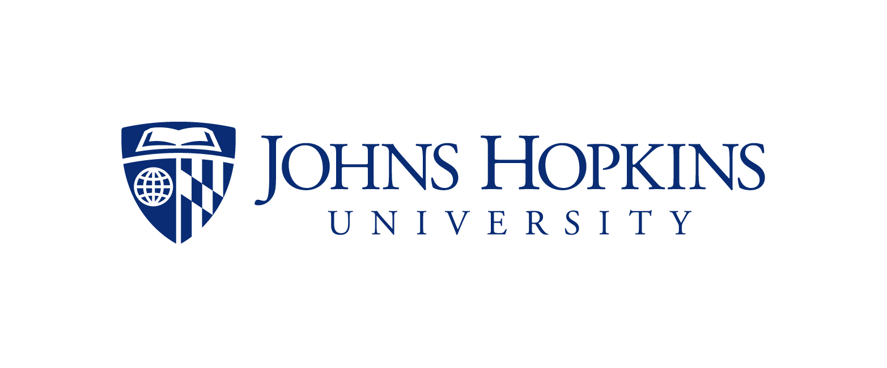

# About Us
We are a team of academic researchers who utilize web and social media data to study public health. We develop novel natural language processing and machine learning models
and apply them to social media datasets.

This website hosts Twitter data related to COVID-19. You can learn more about our work at:

- [http://covid19dataresources.org](http://covid19dataresources.org), part of [http://socialmediaforpublichealth.org/](http://socialmediaforpublichealth.org/)
- Professor Mark Dredze's <a href="http://www.dredze.com">website</a>

This dataset was created and maintained by:

### [David Broniatowski](https://www2.seas.gwu.edu/~broniatowski/index.html)
Professor David Broniatowski is an Associate Professor in the Department of Engineering Management and Systems Engineering at George Washington University.

### [Mark Dredze](http://www.dredze.com)
Professor Mark Dredze is the John C Malone Associate Professor of Computer Science at Johns Hopkins University.

### [Xiaolei Huang](https://sites.google.com/site/xiaoleiedu/)
Xiaolei Huang is a Ph.D. candidate at the University of Colorado Boulder.

### [Amelia Jamison](https://sph.umd.edu/people/amelia-jamison-0)
Amelia Jamison is a Faculty Research Assistant in the Center for Health Equity at the University of Maryland.

### [Sandra Crouse Quinn](https://sph.umd.edu/people/sandra-c-quinn)
Professor Sandra Crouse Quinn is a Professor in the Department of Family Science at the University of Maryland.

